# TAS5-Wordpress con Docker 
## 1. Titulo
Despliegue de un Sitio WordPress con Contenedores Docker Usando Comandos CLI
## 2. Tiempo de duración
El tiempo fue de 120 minutos. 
## 3. Fundamentos:

## Contenedor Docker 

Un contenedor de Docker es un entorno de ejecución que tiene todos los componentes necesarios (como el código, las dependencias y las bibliotecas) para ejecutar el código de la aplicación sin utilizar las dependencias de la máquina host. Este tiempo de ejecución del contenedor se ejecuta en el motor de un servidor, una máquina o una instancia en la nube. El motor ejecuta varios contenedores en función de los recursos subyacentes disponibles(Imagen de Docker y Contenedor: Diferencia Entre Tecnologías de Implementación de Aplicaciones - AWS, n.d.). 

- Estándar: Docker creó el estándar de la industria para contenedores, para que pudieran ser portátiles en cualquier lugar
- Ligero: los contenedores comparten el núcleo del sistema operativo de la máquina y, por lo tanto, no requieren un sistema operativo por aplicación, lo que impulsa una mayor eficiencia del servidor y reduce los costos de servidor y licencias.
- Seguro: las aplicaciones son más seguras en contenedores y Docker proporciona las capacidades de aislamiento predeterminadas más sólidas de la industria.

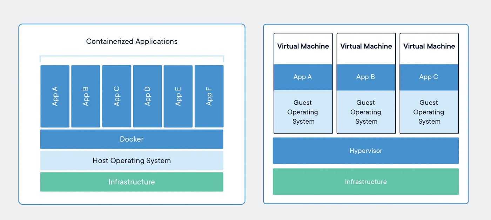

## Volumenes Docker 

Los volúmenes son almacenes de datos persistentes para contenedores, creados y administrados por Docker. Puedes crear un volumen específicamente con el docker volume createcomando, o Docker puede crearlo durante la creación del contenedor o servicio. Al crear un volumen, este se almacena en un directorio del host de Docker. Al montarlo en un contenedor, este directorio es el que se monta en el contenedor. Esto es similar al funcionamiento de los montajes de enlace, salvo que Docker administra los volúmenes y los pasillos de la funcionalidad principal del host (Volúmenes | Documentación de Docker, n.d.).

## Cuando utilizar volumenes

Los volúmenes son el mecanismo preferido para la persistencia de los datos generados y utilizados por los contenedores Docker. Si bien los montajes de enlace dependen de la estructura de directorios y del sistema operativo del equipo host, Docker gestiona completamente los volúmenes. Los siguientes volúmenes son una buena opción para los casos de uso:

- Es más fácil realizar copias de seguridad o migrar volúmenes que montajes enlazados.
- Puede administrar volúmenes mediante los comandos CLI de Docker o la API de Docker.
- Los volúmenes funcionan tanto en contenedores Linux como Windows.
- Los volúmenes se pueden compartir de forma más segura entre varios contenedores.
- Los nuevos volúmenes pueden tener su contenido rellenado previamente por un contenedor o una compilación.
- Cuando su aplicación requiere E/S de alto rendimiento.

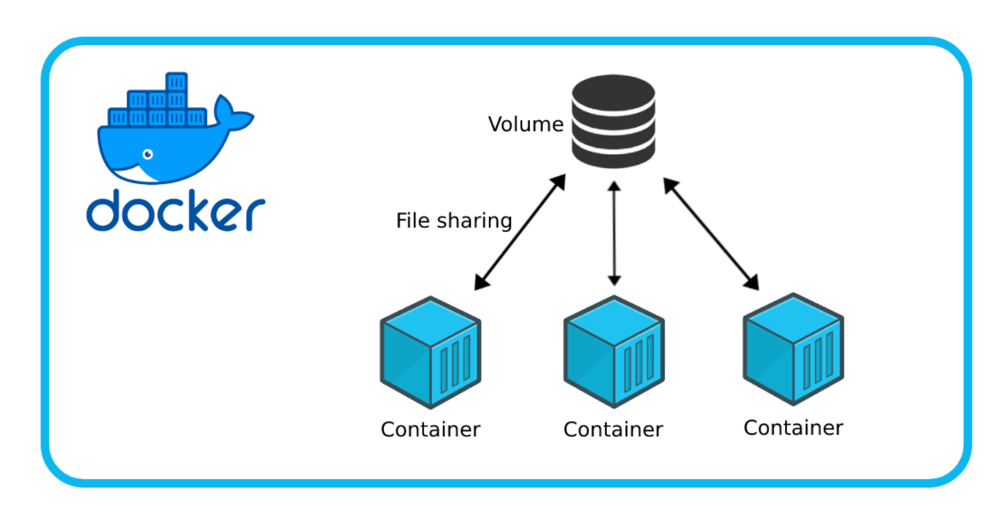

## Redes Docker 

Las redes Docker configuran las comunicaciones entre contenedores vecinos y servicios externos. Los contenedores deben estar conectados a una red Docker para recibir conectividad de red. Las rutas de comunicación disponibles para el contenedor dependen de sus conexiones de red (Docker Networking - Basics, Network Types & Examples, n.d.).

La red de contenedores se refiere a la capacidad de los contenedores de conectarse y comunicarse entre sí o con cargas de trabajo que no sean Docker. Los contenedores tienen la red habilitada por defecto y pueden realizar conexiones salientes. Un contenedor no tiene información sobre el tipo de red al que está conectado ni si sus pares también son cargas de trabajo de Docker. Un contenedor solo ve una interfaz de red con una dirección IP, una puerta de enlace, una tabla de enrutamiento, servicios DNS y otros detalles de red. Esto es así, a menos que el contenedor utilice el nonecontrolador de red (Redes | Documentación de Docker, n.d.).

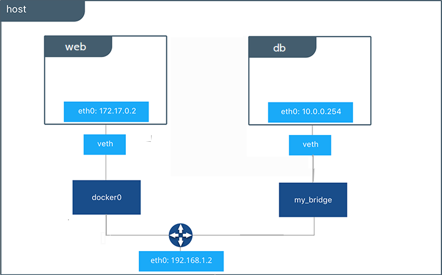

## MySQL 

La forma tradicional de ejecutar una base de datos MySQL es instalar los paquetes MySQL y las aplicaciones simplemente tendrían que conectarse al puerto de escucha. La mayoría de las tareas de administración, como el ajuste de la configuración, las copias de seguridad, la restauración, la actualización de la base de datos, el ajuste del rendimiento y la resolución de problemas, deben ejecutarse en el propio host de la base de datos. Se espera que haya varios puertos accesibles para la conexión, por ejemplo, el puerto TCP 22 para SSH, el TCP 3306 para MySQL o el UDP 514 para syslog (Contenedores Docker de MySQL: Conceptos Básicos | Variousnines, n.d.).

En un contenedor, piense en MySQL como una sola unidad que solo sirve contenido relacionado con MySQL en el puerto 3306. La mayor parte de las operaciones se realizan en este único canal. Docker funciona de maravilla empaquetando su aplicación/software en una sola unidad, que luego puede implementar en cualquier lugar siempre que el motor Docker esté instalado. Espera que el paquete o la imagen se ejecute como un único proceso por contenedor. Con Docker, el flujo sería que usted (o alguien más) cree una imagen de MySQL con una versión y un proveedor específicos, la empaquete y la distribuya a cualquiera que desee ejecutar una instancia de MySQL rápidamente (Contenedores Docker de MySQL: Conceptos Básicos | Variousnines, n.d.).

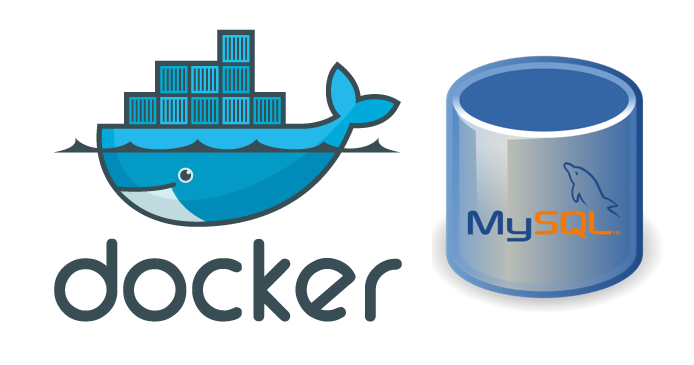

## PhpMyAdmin

Sin una interfaz de usuario, solo se puede interactuar con MySQL mediante la Terminal (o PowerShell y el Símbolo del sistema, según el sistema operativo). phpMyAdmin soluciona este problema al ser una aplicación web portátil de código abierto que actúa como herramienta de administración para MySQL. Una alternativa sería MySQL Workbench , pero requiere instalación en el equipo local y anula el propósito de usar Docker. Docker es una herramienta que empaqueta software en contenedores, independientemente del sistema local. Docker se utilizó para ejecutar MySQL y phpMyAdmin en el equipo local sin necesidad de instalación, y puede usarse para empaquetar toda la configuración en el futuro (MySQL y PhpMyAdmin En Docker - Ciencia de Datos de Pila Completa, n.d.).

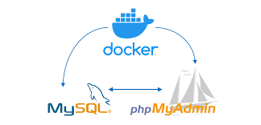

## Wordpress 

WordPress es la herramienta de creación de sitios web líder en todo el mundo, impulsando más de la mitad del contenido en internet. Este sistema de gestión de contenidos (CMS) de código abierto es versátil y fácil de usar, lo que lo convierte en una opción ideal para usuarios de todos los niveles (¿Qué Es WordPress? Características, Funcionamiento y Ejemplos., n.d.). 

WordPress llegó para democratizar la web, como otros CMS. Desde el año 2003, es un sistema de gestión de contenidos que hace que la creación de contenido web no dependa sólo de programadores y de personas de alto conocimiento técnico. Ahora, cualquier persona puede crear una web (¿Qué Es WordPress, Para Qué Sirve y Cómo Funciona?, n.d.).

WordPress se divide en tres partes:

Core: WordPress en sí, que es absolutamente gratuito y descargable.
Temas: que sirven para cambiar la apariencia de la web. Hay un enorme repositorio gratuito, pero también hay recursos de pago fuera del repositorio.
Plugins: utilidades que pueden convertir tu web en casi cualquier cosa. Igualmente que los temas, hay un repositorio gratuito y miles de empresas que venden sus funcionalidades.

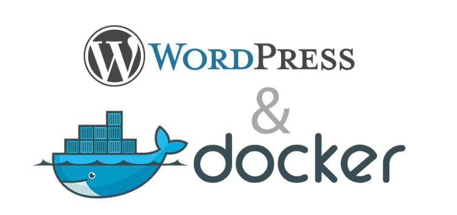

## 4. Conocimientos previos.
   
Para realizar esta practica el estudiante necesita tener claro los siguientes temas:
- Comandos de Docker.
- Conceptos de contenedores y volumenes.
- Conceptos básicos de bases de datos.
- Conocimientos de acceso web y puertos.

## 5. Objetivos a alcanzar

- Crear una red.
- Crear un volumen para wordpress.
- Crear un volumen para mysql.
- Crear un contenedor para mysql.
- Crear un contenedor para phpmyadmin.
- Crear un contenedor de wordpress.

## 6. Equipo necesario:
  
- Computador.
- Docker funcionando.
- Navegador web.

## 7. Material de apoyo.
   
- Documentación de Docker
- Guía de asignatura.
- Cheat Sheet de comandos Docker.
- Documentación oficial de MySQL, phpMyAdmin y Wordpress.
- Videos tutoriales.

## 8. Procedimiento

### Pasos 

1. Crear un red personalizada.

Figura 8-1 Creación de la red personalizada 

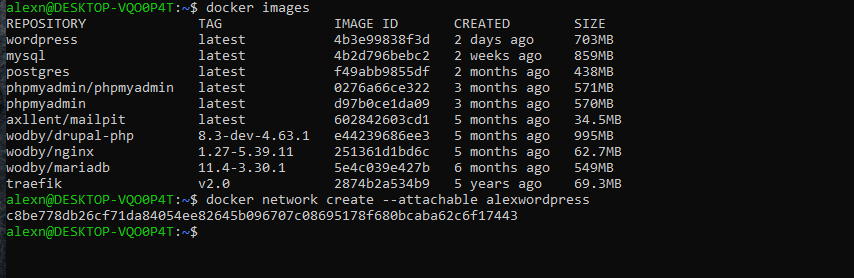

2. Crear un volumen para wordpress.
3. Crear un volumen para mysql.

Figura 8-2 Creacion de los volumenes para wordpress y mysql.

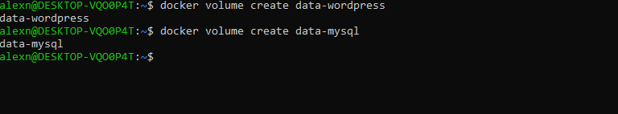

4. Crear un contenedor para mysql.
   
Figura 8-3 Creacion del contenedor para mysql.

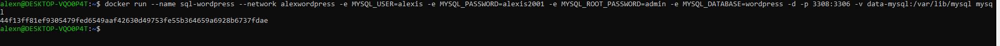

5. Crear un contenedor para phpmyadmin.

Figura 8-4 Figura 8-3 Creacion del contenedor para phpmyadmin.

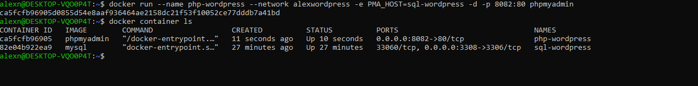

6. Crear un contenedor para wordpress.

Figura 8-5 Figura 8-3 Creacion del contenedor para wordpress.

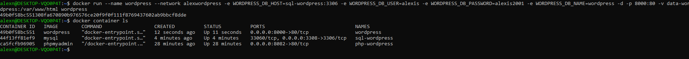

## 9. Resultados esperados:
    
Al finalizar la práctica, se logró cumplir exitosamente los objetivos planteados. Se desplegó correctamente un contenedor de base de datos MySQL, configurando las credenciales de acceso (root/admin) y exponiendo el puerto 3307. Mediante la creación de una red personalizada, se facilitó la comunicación entre los contenedores de MySQL y phpMyAdmin, evitando conflictos de puertos y garantizando la resolución de nombres de servicio.

Desde phpMyAdmin, accedido a través del navegador en el puerto 8081, se pudo gestionar el servidor MySQL y crear de forma gráfica una base de datos de prueba, verificando así la conectividad y funcionamiento del sistema. Durante el proceso se aplicaron comandos esenciales de Docker como ``docker network create``, ``docker network connect``, y se comprendió la importancia de las variables de entorno para la configuración de servicios. Todo el desarrollo de la práctica fue documentado con capturas de pantalla que evidencian la creación de la red, el despliegue de los contenedores, la configuración de acceso y la creación exitosa de una base de datos de prueba desde phpMyAdmin.

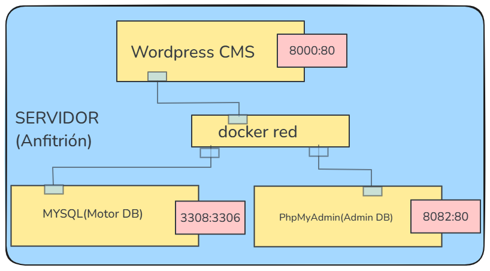

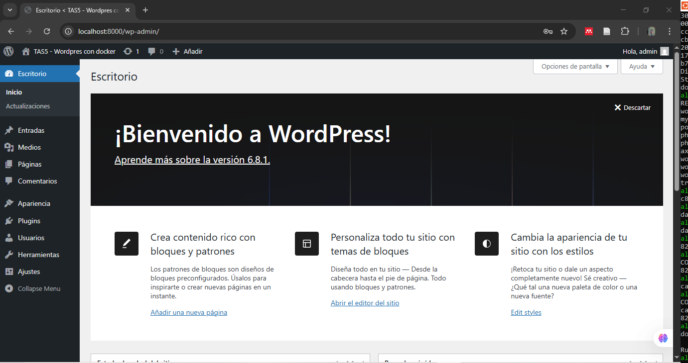

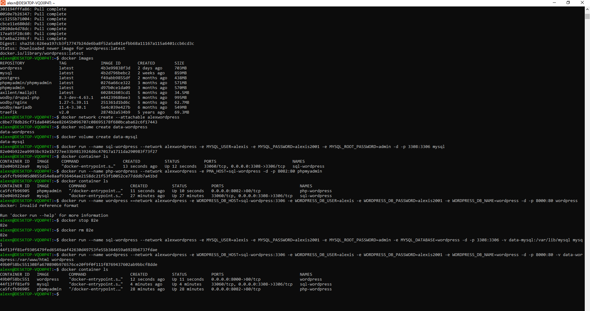

## 10. Bibliografía
    
- Docker. (n.d.). What is a container? Retrieved April 10, 2025, from https://www.docker.com/resources/what-container/
- Docker. (n.d.). Networks | Docker Documentation. Retrieved April 25, 2025, from https://docs.docker.com/engine/network/
- Docker. (n.d.). Volumes | Docker Documentation. Retrieved April 17, 2025, from https://docs-docker-com.translate.goog/engine/storage/volumes/?_x_tr_sl=en&_x_tr_tl=es&_x_tr_hl=es&_x_tr_pto=tc
- Hostinger. (n.d.). What is WordPress? Features, how it works, and examples. Retrieved May 2, 2025, from https://www.hostinger.com/es/tutoriales/que-es-wordpress
- Instituto Cajasol. (n.d.). What is WordPress, what is it for, and how does it work? Retrieved May 2, 2025, from https://institutocajasol.com/que-es-wordpress-y-como-funciona/
- Spacelift. (n.d.). Docker networking: Basics, network types & examples. Retrieved April 25, 2025, from https://spacelift.io/blog/docker-networking
- Variousnines. (n.d.). MySQL Docker containers: Understanding the basics. Retrieved April 25, 2025, from https://severalnines.com/blog/mysql-docker-containers-understanding-basics/
- Yewcy, A. (n.d.). MySQL and phpMyAdmin on Docker – Full stack data science. Retrieved April 25, 2025, from https://andrewyewcy.com/MySQL-and-phpMyAdmin-on-Docker/
 

